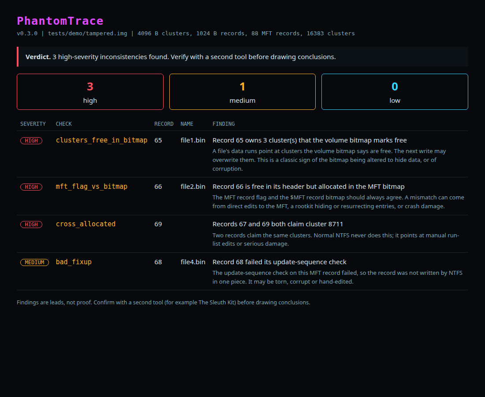

# PhantomTrace


NTFS describes the same disk in several places. Honest activity keeps those descriptions in agreement; tampering (and corruption) often doesn't. PhantomTrace reads a raw NTFS image or device, **read-only**, and reports where the layers disagree.

```
  ___ _                 _               _____
 | _ \ |_  __ _ _ _  __| |_ ___ _ __   |_   _| _ __ _ __ ___
 |  _/ ' \/ _` | ' \/ _|  _/ _ \ '  \    | || '_/ _` / _/ -_)
 |_| |_||_\__,_|_||_\__|\__\___/_|_|_|   |_||_| \__,_\__\___|
  v0.3.0  |  read-only NTFS cross-layer consistency checker

  Target  tests/demo/tampered.img
  Volume  4096 B clusters | 1024 B MFT records | 88 records | 16383 clusters

  [HIGH] mft_flag_vs_bitmap x1
      • Record 66 is free in its header but allocated in the MFT bitmap  (file2.bin)
      The MFT record flag and the $MFT record bitmap should always agree. A mismatch can come from direct edits to the MFT, a rootkit hiding or resurrecting entries, or crash damage.

  [HIGH] clusters_free_in_bitmap x1
      • Record 65 owns 3 cluster(s) that the volume bitmap marks free  (file1.bin)
      A file's data runs point at clusters the volume bitmap says are free. The next write may overwrite them. This is a classic sign of the bitmap being altered to hide data, or of corruption.

  [HIGH] cross_allocated x1
      • Records 67 and 69 both claim cluster 8711
      Two records claim the same clusters. Normal NTFS never does this; it points at manual run-list edits or serious damage.

  [MEDIUM] bad_fixup x1
      • Record 68 failed its update-sequence check  (file4.bin)
      The update-sequence check on this MFT record failed, so the record was not written by NTFS in one piece. It may be torn, corrupt or hand-edited.

  Summary  high 3  medium 1  low 0   (0.00s)
  Verdict  3 high-severity inconsistencies found. Verify with a second tool before drawing conclusions.
```

Also writes a shareable report (`--html report.html`):



## Install

```
pipx install git+https://github.com/JackSessions/PhantomTrace   # gives you the `phantom-trace` command
# or just run the single file:
python3 phantom_trace.py image.img
```

## Quick test on Linux

```
sudo apt install ntfs-3g          # provides mkntfs, ntfscp and ntfs-3g
./tests/quick.sh                  # unit tests, then the clean vs tampered demo
```

It builds a clean NTFS image and a tampered copy: the clean one should report nothing (exit `0`), the tampered one should report findings (exit `1`).

To check a real NTFS disk or USB stick, image it first and analyse the image, so the original is never touched:

```
sudo dd if=/dev/sdXN of=disk.img bs=4M status=progress   # or: sudo ddrescue /dev/sdXN disk.img
phantom-trace disk.img
# a whole-disk image: find the partition start with `fdisk -l disk.img`, then pass --offset <start sector * 512>
```

## Checks

| ID | What it compares | Why it matters |
|---|---|---|
| `mft_flag_vs_bitmap` | A record's "in use" flag vs the `$MFT`'s own record bitmap (`$MFT:$BITMAP`) | Hidden or resurrected entries, edited MFT, crash damage |
| `clusters_free_in_bitmap` | Clusters a file's data runs claim vs the volume `$Bitmap` | Bitmap altered to hide data, or corruption; the next write may overwrite it |
| `cross_allocated` | Two records claiming the same cluster | Manual run-list edits or serious damage |
| `run_out_of_bounds` | A data run outside the volume | Invalid or forged run list |
| `bad_fixup` | MFT update-sequence (fix-up) verification | Torn, corrupt or hand-edited records |
| `mirror_mismatch` | First MFT records vs `$MFTMirr` (low confidence) | Worth a look; crashes can cause it too |

## Usage

```
phantom-trace image.img                       # coloured, human-readable
phantom-trace image.img --json                # for scripts
phantom-trace image.img --html report.html    # self-contained report
phantom-trace image.img --csv findings.csv    # spreadsheet / timeline work
phantom-trace image.img -q                    # just the verdict (good for scripts)
phantom-trace disk.img --offset 1048576       # NTFS partition inside a disk image
```

Standard library only (Python 3.9+). Use a raw image where you can; a live device needs admin/root. It never writes. Exit codes: `0` clean, `1` findings, `2` error.

## How it is tested

The test suite builds **real NTFS volumes** with `mkntfs`/`ntfscp`, then makes controlled changes and checks the result:

| Scenario | Expected |
|---|---|
| Fresh volume with 24 files; a second with 700 files | no findings (no false positives) |
| Clear a file's clusters in `$Bitmap` | `clusters_free_in_bitmap` |
| Flip an in-use record to "deleted" in its header only | `mft_flag_vs_bitmap` |
| Point one file's run at another file's clusters | `cross_allocated` |
| Corrupt a record's fix-up bytes | `bad_fixup` |
| Alter a `$MFTMirr` record | `mirror_mismatch` |

Run them with `python3 -m unittest discover -s tests -v` (needs `ntfs-3g` for the image tools).

## Known limitations

- The test images were made with the ntfs-3g tools and tampered with by this project's own helper. They have not yet been checked against volumes formatted and used by Windows, or against known real-world anti-forensic tooling. Treat a finding as a lead to verify with another tool (for example The Sleuth Kit), not as proof.
- A heavily fragmented `$MFT` that uses an `$ATTRIBUTE_LIST` is only read from its first extent (the tool warns when it sees this).
- Compressed and sparse files: sparse runs are skipped; compressed streams are not checked in depth.
- Only the unnamed and named non-resident attributes in in-use records are checked; `$LogFile` and `$UsnJrnl` analysis are not implemented.

## Roadmap

- Validate against Windows-made images and real tampering tools
- `$ATTRIBUTE_LIST` and fragmented-MFT support
- Timeline output (CSV / bodyfile) and `$STANDARD_INFORMATION` vs `$FILE_NAME` timestamp comparison
- Compare results with The Sleuth Kit and MFTECmd on shared images

## Licence

Not set yet. Add one before others reuse the code.
